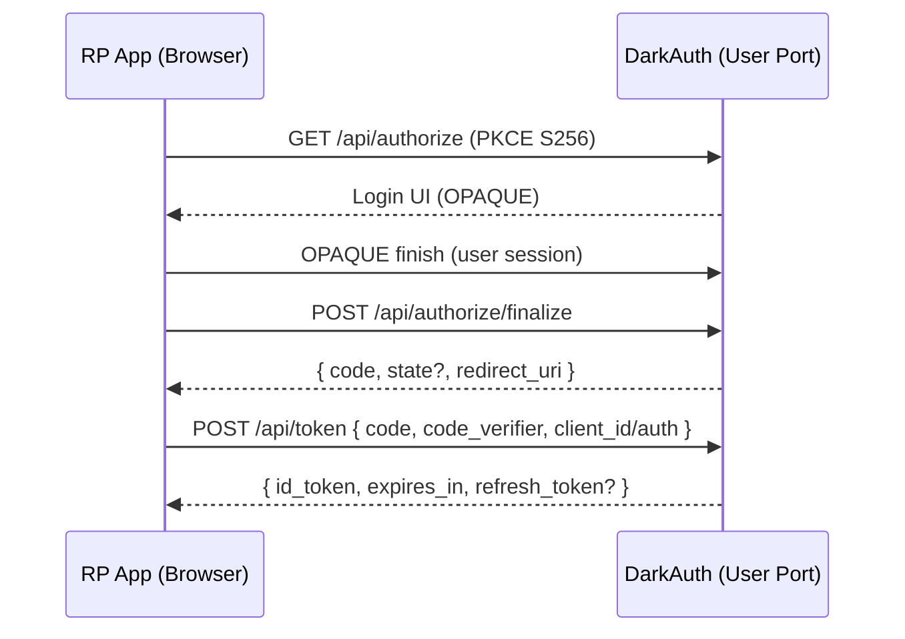
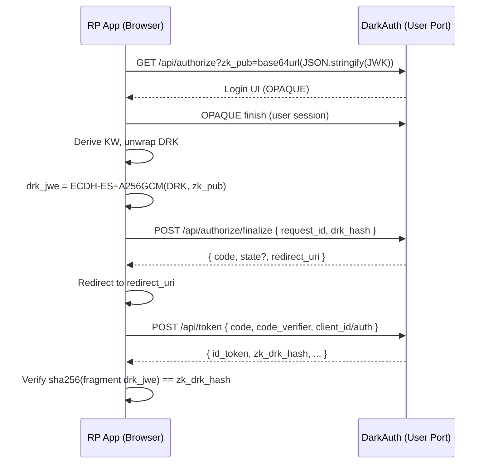

# DarkAuth v1 Security Whitepaper

Date: 2025-09-11

Abstract

DarkAuth is an OpenID Connect (OIDC) provider that integrates a zero‑knowledge (ZK) extension for client‑side key delivery. Users authenticate with OPAQUE (RFC 9380), so passwords never leave the device. A per‑user Data Root Key (DRK) is wrapped under a device‑derived key and persisted server‑side only as ciphertext. ZK‑enabled relying parties (clients) receive the DRK via a compact JWE placed solely in the URL fragment; the authorization server never stores or returns that JWE, only its hash for verification. This document explains primitives, flows, state, properties, threats, and verification guidance strictly for the current v1 implementation.

Table of Contents

1. Executive Summary
2. System Overview
3. Cryptographic Primitives and Key Schedule
4. Protocol Flows
5. Data and State
6. Endpoints (as implemented)
7. Security Properties and Assurances
8. Threat Model
9. Password Change Without Key Loss
10. Operational Security
11. Privacy and Compliance Posture
12. Limitations and Future Work
13. Auditor Verification Checklist
14. Glossary and References

## 1) Executive Summary

DarkAuth provides OIDC with a zero‑knowledge security posture:
- Password secrecy: OPAQUE ensures the server never learns user passwords.
- Client‑side key control: A deterministic device‑derived key wraps a per‑user DRK; only wrapped DRK is stored.
- Fragment‑only key delivery: ZK clients receive DRK via a compact JWE in the URL fragment, never through server responses. The token response includes a hash of that JWE for client‑side integrity binding.

ELI5
- You prove your password without revealing it.
- Your device makes a secret key and uses it to lock your data key.
- The server keeps only the locked box, not the key inside.
- Apps get the key in a sealed envelope that the server never sees.

## 2) System Overview

Components (v1)
- User UI + OIDC (port 9080): OIDC discovery, authorization, token, OPAQUE endpoints, DRK endpoints, directory.
- Admin UI/API (port 9081): Admin OPAQUE, clients, settings, JWKS, audit, RBAC.
- Relying Parties (apps): Use Authorization Code + PKCE; ZK‑enabled clients opt into fragment JWE DRK delivery.

Runtime configuration
- All shared/runtime settings are stored in Postgres (`settings` table). UIs read runtime config from `/config.js`.
- `config.yaml` contains only instance‑specific settings like ports, database URI, and the KEK passphrase. No shared secrets here.
- KEK is derived at boot from the passphrase; private JWKs and client secrets are stored encrypted when KEK is available.

Tenant model
- v1 assumes single‑tenant; key derivation salts use TENANT="default".

## 3) Cryptographic Primitives and Key Schedule

OPAQUE (RFC 9380)
- Password‑authenticated key exchange. Server stores an opaque verifier; cannot recover the password.
- Client obtains an `export_key` deterministically per (user, password).
- Implementation uses the P‑256 OPAQUE ciphersuite as configured by the OPAQUE library.

Key schedule (client)
- MK = HKDF‑SHA256(export_key, salt = H("DarkAuth|v1|tenant=default|user=" + sub), info = "mk")
- KW = HKDF‑SHA256(MK, salt = "DarkAuth|v1", info = "wrap-key")
- KDerive = HKDF‑SHA256(MK, salt = "DarkAuth|v1", info = "data-derive")

Data Root Key (DRK)
- 32‑byte random, generated client‑side on first login.
- Server only stores WRAPPED_DRK = AEAD_Encrypt(KW, DRK, aad=sub).
- On each session, client derives KW from export_key and unwraps the DRK locally.

JWE for DRK handoff (ZK delivery)
- ECDH‑ES (P‑256) with A256GCM, compact serialization.
- Recipient key: RP app’s ephemeral `zk_pub` JWK provided in the authorization request.
- AAD includes `{ sub, client_id }`.
- Binding: `drk_hash = base64url(SHA‑256(drk_jwe))` stored with the authorization code; token response includes `zk_drk_hash`.

ID Token signing
- EdDSA (Ed25519) per generated JWKS.

PKCE
- S256 is required for public clients and when configured.

Key schedule diagram (ASCII)

export_key (OPAQUE)
  | HKDF-SHA256 (salt=H("DarkAuth|v1|tenant=default|user="+sub), info="mk")
  v
  MK
   | HKDF-SHA256 (salt="DarkAuth|v1", info="wrap-key")   | HKDF-SHA256 (salt="DarkAuth|v1", info="data-derive")
   v                                                    v
   KW  ----------------------------------------------> KDerive
   |
   | AEAD-Encrypt(KW, DRK, aad=sub)
   v
  WRAPPED_DRK (server stores only this)

## 4) Protocol Flows

Discovery and JWKS
- `GET /api/.well-known/openid-configuration`
- `GET /api/.well-known/jwks.json`

Authorization Code + PKCE (standard clients)
1. Client initiates `GET /api/authorize` with `client_id, redirect_uri, response_type=code, scope, state, code_challenge, code_challenge_method=S256`.
2. User authenticates via OPAQUE. On success, server issues a code via `POST /api/authorize/finalize` (JSON response with `{ code, state?, redirect_uri }`).
3. Client calls `POST /api/token` with `grant_type=authorization_code`, the `code`, `redirect_uri`, `client_id` (or client auth), and `code_verifier`. Server returns `id_token` (EdDSA), `token_type`, `expires_in`, and optionally `refresh_token`.

ZK extension (fragment JWE delivery)
1. Client adds `zk_pub=<base64url(JSON.stringify(JWK))>` to `GET /api/authorize`. Server validates zk_pub only if client is configured with `zk_delivery='fragment-jwe'`.
2. After OPAQUE, the browser unwraps DRK locally; constructs `drk_jwe = ECDH-ES+A256GCM(DRK, zk_pub)` with AAD `{ sub, client_id }`.
3. Browser computes `drk_hash = base64url(sha256(drk_jwe))` and calls `POST /api/authorize/finalize` with `{ request_id, drk_hash }`. Server creates a code, flags `has_zk=true`, and stores `drk_hash` (not the JWE).
4. Browser redirects to `redirect_uri?...#drk_jwe=<compact JWE>`.
5. Client calls `POST /api/token` and receives `zk_drk_hash` when `has_zk=true`. Client must verify `base64url(sha256(fragment drk_jwe)) === zk_drk_hash` before using DRK.

Implementation note
- The normative encoding for `zk_pub` is `base64url(JSON.stringify(JWK))` and `zk_pub_kid = SHA‑256(zk_pub)` computed over the exact base64url string. The server implementation is being aligned to this; clients already use the base64url format.

Sequence notes
- The server NEVER stores or returns the DRK JWE; only the hash is stored/returned. The fragment is visible only to the browser/app.
- Code TTL is ≤ 60s and codes are single‑use.

Standard authorization code flow (Mermaid)

ZK fragment JWE flow (Mermaid)

## 5) Data and State

Server stores
- OPAQUE verifier/envelope (no passwords).
- WRAPPED_DRK ciphertext (AAD=sub), not DRK/KW.
- Pending authorization requests; authorization codes with `has_zk`, `zk_pub_kid`, and `drk_hash`.
- JWKS (public JWKs; private JWKs encrypted at rest when KEK is available).
- Clients, settings (including runtime flags for OIDC/PKCE, id token TTLs, etc.).
- Sessions and refresh tokens.
- Audit logs (admin actions).

Server never stores
- Plaintext passwords or export_key.
- Plaintext DRK or DRK JWE ciphertext.
- Derived keys MK/KW/KDerive.

Sessions and claims
- SPA model: `/session` for minimal info; `/refresh-token` rotates session tokens.
- ID tokens may include `permissions` and `groups` claims when configured.

## 6) Endpoints (as implemented)

User/OIDC (port 9080)
- `GET /api/.well-known/openid-configuration`
- `GET /api/.well-known/jwks.json`
- `GET /api/authorize` (supports `zk_pub` when client is ZK‑enabled)
- `POST /api/authorize/finalize` (form): `{ request_id, drk_hash? }`
- `POST /api/token` (form): authorization_code; returns `zk_drk_hash` when applicable
- `POST /opaque/login/start`, `POST /opaque/login/finish`
- `POST /opaque/register/start`, `POST /opaque/register/finish`
- `POST /password/change/verify/start`, `POST /password/change/verify/finish`
- `POST /password/change/start`, `POST /password/change/finish`
- `GET /crypto/wrapped-drk`, `PUT /crypto/wrapped-drk`
- `PUT /crypto/enc-pub` (publish user encryption public JWK)
- `GET /crypto/wrapped-enc-priv`, `PUT /crypto/wrapped-enc-priv` (DRK‑wrapped private key)
- `GET /users/search`, `GET /users/:sub`
- `GET /session`, `POST /refresh-token`, `POST /logout`

Admin (port 9081) — highlights
- `POST /admin/opaque/login/start`, `POST /admin/opaque/login/finish`
- JWKS list and rotation; clients, settings, users, groups, permissions management; audit logs (list, detail, export)

Constraints
- PKCE S256 required for public clients and when configured.
- Code TTL ≤ 60s; single‑use.
- ZK delivery is opt‑in per client; `zk_pub` accepted only when `zk_delivery='fragment-jwe'`.
- Discovery returns authoritative absolute URLs; clients SHOULD use discovery rather than hard‑coding paths.

## 7) Security Properties and Assurances

Password secrecy (OPAQUE)
- Server never receives passwords; verifiers do not allow offline recovery. Login finish binds the authenticated account to server‑tracked identity; enumeration resistance and rate limits are applied.

DRK secrecy
- Only wrapped DRK is stored. Without KW (derived from export_key on the device), the server cannot decrypt DRK.

Fragment‑only DRK delivery
- Server never stores or returns the DRK JWE. The token includes `zk_drk_hash` for integrity binding to the fragment.

Public key validation (zk_pub)
- `base64url(JSON.stringify(JWK))` for P‑256; validate JWK structure and that `x` and `y` decode to 32‑byte values.
- Current implementation validates structure/length; explicit on‑curve validation is recommended and planned.
- Keys MUST NOT include private components (no `d`). Malformed or weak keys are rejected with `invalid_request`.

Logging restrictions
- Do not log passwords, export_key, MK/KW/KDerive, DRK, DRK JWE, `zk_pub`, or token secrets.
- Authorization codes SHOULD NOT be logged; an error path currently logs a code on token failure and will be removed.

ID token integrity
- EdDSA signatures over standard ID token claims; optional `permissions`/`groups` when configured.

## 8) Threat Model

Assumptions
- TLS for all transports.
- RP applications correctly handle fragments and verify `zk_drk_hash`.
- User devices are not fully compromised.

Attacks and mitigations
- Database exfiltration: OPAQUE verifiers and wrapped DRK do not reveal passwords or DRK.
- Insider reads: No plaintext passwords/DRK stored; KEK encrypts private JWKs and client secrets.
- Redirect tampering: Clients verify `zk_drk_hash` before using `drk_jwe`.
- Weak key injection: Strict zk_pub validation and rejection policy.
- Token endpoint abuse: PKCE S256 for public clients; codes are short‑lived and single‑use.

Out of scope
- Compromised user devices or RP apps mishandling decrypted DRK.
- Broken TLS.

## 9) Password Change Without Key Loss

Goal
- Allow password change while preserving the DRK so apps continue to decrypt data without re‑encryption.

Process
1. Verify current password using OPAQUE verify endpoints.
2. Re‑register new password (OPAQUE registration).
3. Derive a new KW from the new export_key.
4. Rewrap the same DRK under the new KW and upload the updated ciphertext.

What apps observe
- DRK remains the same; fragment JWE is new per authorization, but decrypts to the same DRK. No data re‑encryption is required.

## 10) Operational Security

Rate limiting
- OPAQUE login and finalize endpoints are rate‑limited per implementation.

Logging policy
- Prohibit logging of zk_pub, export_key, MK/KW/KDerive, DRK, DRK JWE, wrapped private keys, and token secrets.

Key management
- JWKS rotation available via admin API; private JWKs encrypted with KEK at rest when available.

Install and KEK
- First‑run install on admin port; single‑use token gating; seeds settings and keys. KEK derived from passphrase in `config.yaml` protects private JWKs and client secrets.

Deployment guidance
- Enforce HTTPS; set secure cookies when used (Secure, HttpOnly, SameSite=Lax or stricter). Store settings in DB; serve `/config.js` to UIs.
- DarkAuth is open source (AGPL). Auditing is community‑driven: read the code and specs in this repository.

## 11) Privacy and Compliance Posture

Data minimization
- Server avoids plaintext secrets: no passwords, no plaintext DRK, no DRK JWE.

Claims
- This document describes technical design and alignment to security best practices; it does not assert formal certifications.

## 12) Limitations and Future Work

- v1 is single‑tenant; multi‑tenant key separation is future work.
- Additional grants and token types may be added.
- Hardware‑backed key storage on clients is outside current scope.

## 13) Auditor Verification Checklist

Discovery and authorization
- Fetch `/api/.well-known/openid-configuration` and `/api/.well-known/jwks.json`.
- Start `GET /api/authorize` with PKCE S256; complete OPAQUE; call `POST /api/authorize/finalize` and confirm code TTL≤60s.

- Provide a valid P‑256 `zk_pub` (base64url(JSON.stringify(JWK))) in `GET /api/authorize`.
- After login, confirm the browser constructs `drk_jwe` client‑side and calls finalize with `drk_hash`.
- Inspect network: server never returns the JWE; only the hash appears in token response as `zk_drk_hash`.
- Verify client computes `base64url(sha256(fragment drk_jwe)) === zk_drk_hash` before use.

DRK storage
- With a valid session, `GET /crypto/wrapped-drk` returns only ciphertext; plaintext DRK is never exposed.

Password change without key loss
- Use verify endpoints, re‑register, then confirm wrapped DRK is reuploaded without rotating the underlying DRK.

Public key validation
- Send malformed `zk_pub` values and confirm `invalid_request` errors and rejection.

Logging
- Confirm logs exclude prohibited materials under normal and error conditions.

## 14) Glossary and References

Glossary
- OPAQUE: Asymmetric password‑authenticated key exchange where the server stores an opaque record and never learns the password.
- DRK: Data Root Key, a per‑user symmetric key for application encryption.
- JWE: JSON Web Encryption; here, compact form with ECDH‑ES (P‑256) and A256GCM.
- PKCE: Proof Key for Code Exchange; S256 is the required code challenge method for public clients.
- MK/KW/KDerive: Keys derived from `export_key` via HKDF; KW wraps DRK.

References
- DarkAuth v1 Technical Spec (specs/2_CORE.md)
- DarkAuth OIDC ZK Extension (specs/0_OIDC_ZK_EXTENSION.md)
- RFC 9380: OPAQUE
- JOSE / JWE standards
